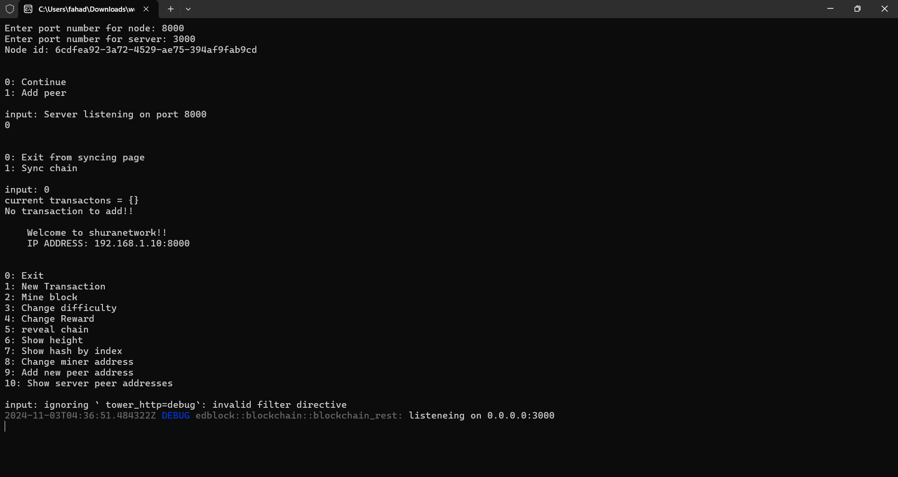
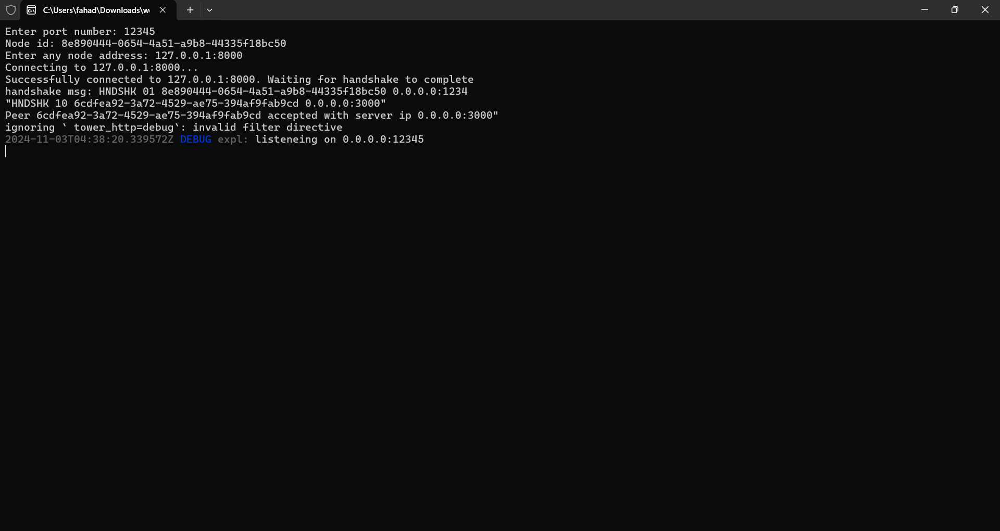
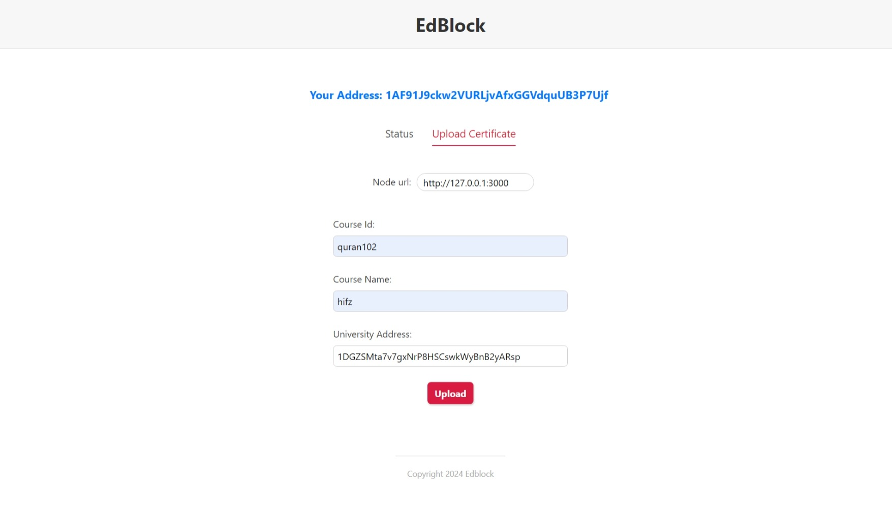
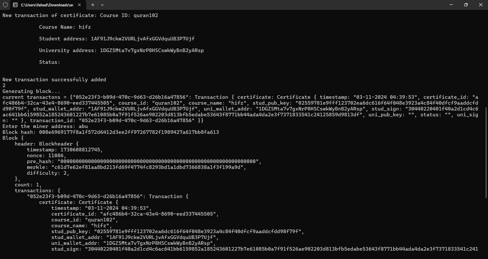
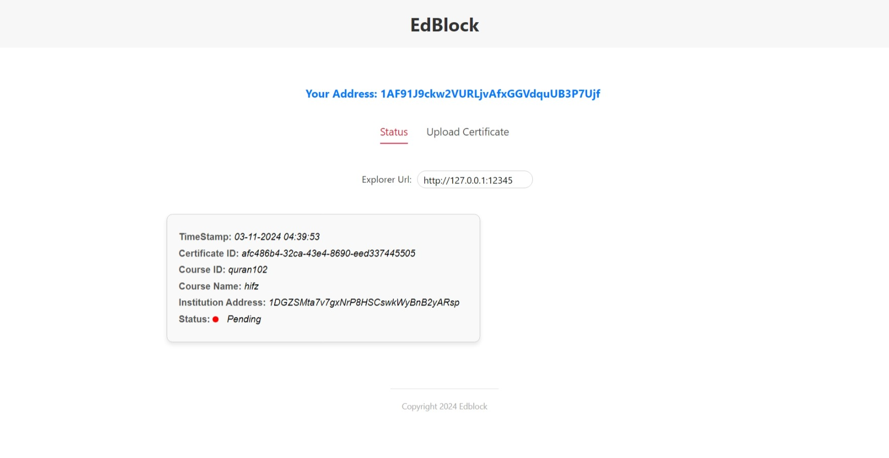
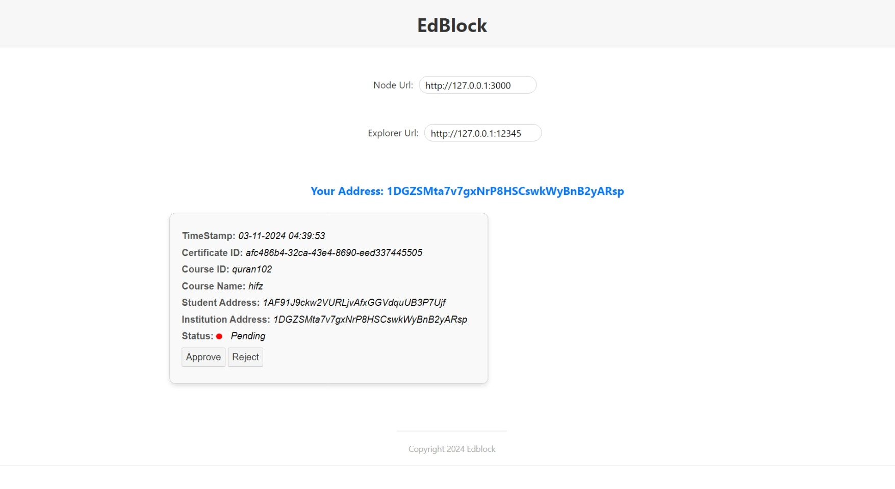
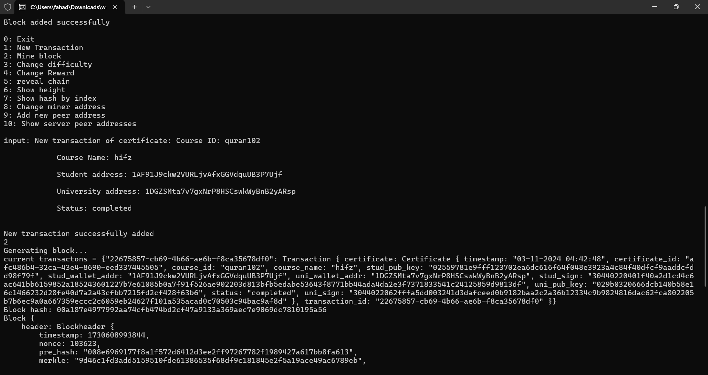
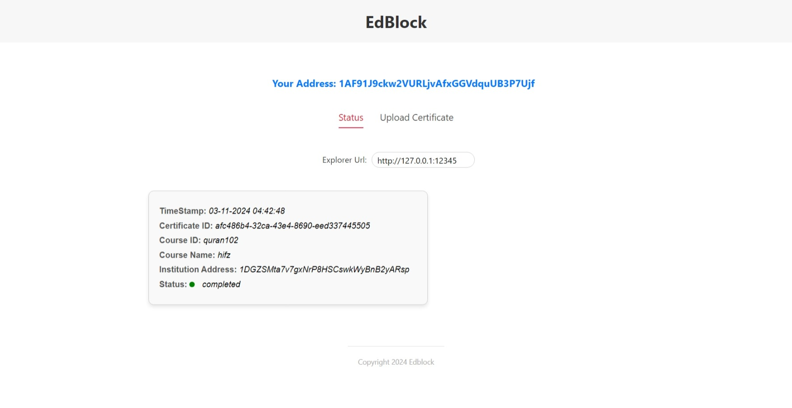
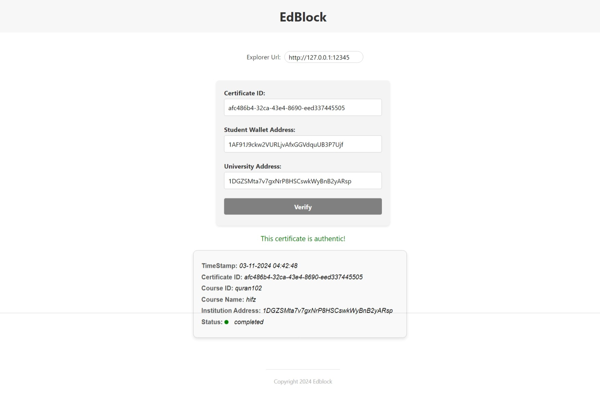

# Edblock
### Blockchain-based Certification Verification System

## Overview
Edblock is a blockchain-based certificate verification system that provides secure and transparent validation of academic certificates. This system includes specific roles for **students**, **universities**, and **vendors**, each with distinct functionalities for managing and verifying certifications.

## Features
- **Student UI**: Allows students to upload certificates and check their status.
- **University UI**: Enables universities to view and approve or reject certificates.
- **Vendor UI**: Allows vendors to verify the authenticity and status of certificates.

## Setup and Installation

### Prerequisites
- **Install Rust**: Ensure Rust is installed on your system. [Click here to install Rust](https://www.rust-lang.org/tools/install)

### Steps
1. **Clone the Repository**
   ```bash
   git clone https://github.com/abuFahad-vp/edblock_v2.git
   ```
2. **Build the Project**
   ```bash
   cd edblock_v2 && cargo build
   ```

## Running the Application

1. **Start the Mining Node**
   ```bash
   cargo run --bin node
   ```
2. **Start the Explorer Node**
   ```bash
   cargo run --bin expl
   ```
3. **Run the Student UI**  
   For uploading certificates:
   ```bash
   cargo run --bin edblock-student
   ```
4. **Run the University UI**  
   For viewing and approving certificates:
   ```bash
   cargo run --bin edblock-uni
   ```
5. **Run the Vendor UI**  
   For verifying certificates:
   ```bash
   cargo run --bin edblock-vendor
   ```

## Usage Instructions

1. **Upload a Certificate**  
   - Use the Student UI app to upload a certificate.
2. **Mine the Certificate**  
   - Run the mining node to publish the certificate on the blockchain.
3. **Approve/Reject the Certificate**  
   - Use the University UI app to approve or reject the certificate.
4. **Update Certificate Status**  
   - Run the mining node again to update the certificate's status on the blockchain.
5. **Verify Certificate**  
   - Vendors can verify the certificate by providing the certificate ID, student address, and university address in the Vendor UI.

## UI Screenshots

- **Blockchain Node**  
  

- **Explorer Node**  
  

- **Student UI** (For uploading certificate details)  
  

- **Mining the Uploaded Certificate by Student**  
  

- **Student UI - Certificate Status (Pending)**  
  

- **University UI** (For approving/rejecting certificates)  
  

- **University UI - Pending Certificate**  
  

- **Mining the Certificate After University Approval**  
  

- **Student UI - Certificate Status (Updated)**  
  

- **Vendor UI** (For verifying certificates)  
  

## License
This project is licensed under the **GNU General Public License (GPL)**.